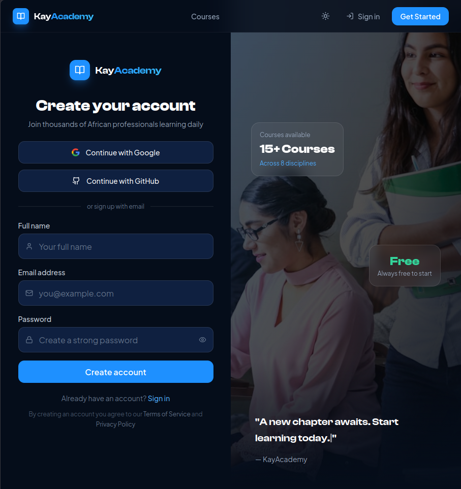
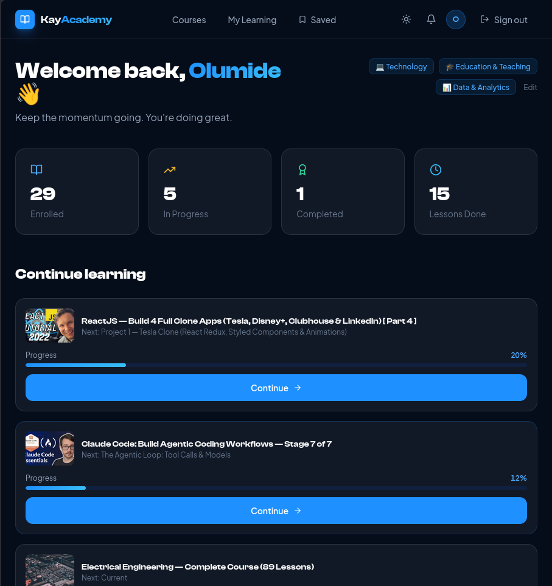
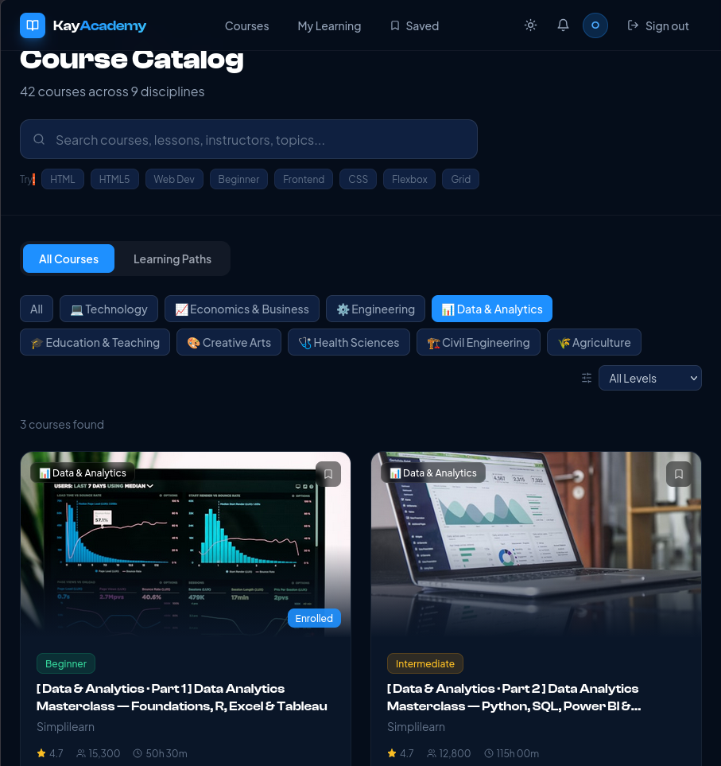
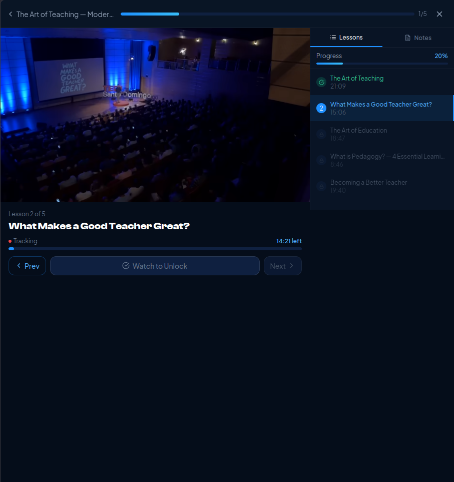

# KayAcademy 🎓

**Free e-learning platform for African professionals**

🌐 **Live Demo:** [kayacademy.vercel.app](https://kayacademy.vercel.app)

## About
KayAcademy is a full-stack e-learning platform targeting African professionals across 
technology, health sciences, engineering, agriculture, economics, and creative arts. 
Students can enroll in structured courses, track progress lesson by lesson, earn 
certificates, and follow curated learning paths from beginner to job-ready.

## Screenshot
**Login Page**
 

**Dashboard**
  

**Course Details**
   

**Lesson Player**

## Features
- 42 courses across 9 disciplines
- 6 structured Learning Paths (Frontend Engineering, Data Analytics, Civil Engineering, Healthcare & Nursing, Agricultural Professional, UI/UX Design)
- YouTube-powered lesson player with real watch-time tracking
- Progress tracking, certificates, bookmarks, and in-app notes
- Dark/light mode, mobile responsive, smart search
- Google OAuth, GitHub OAuth, email authentication
- Onboarding interest selector and personalised course recommendations

## Tech Stack
React 18 · React Router v6 · Supabase (PostgreSQL + Auth + Storage) · Tailwind CSS · Vite · Vercel

## Note
> The full source code for this project is private to protect intellectual property.
> A live demo is available above showcasing complete functionality.

---
Built by [Rico Kay](https://digital-business-card-beta-opal.vercel.app/)
